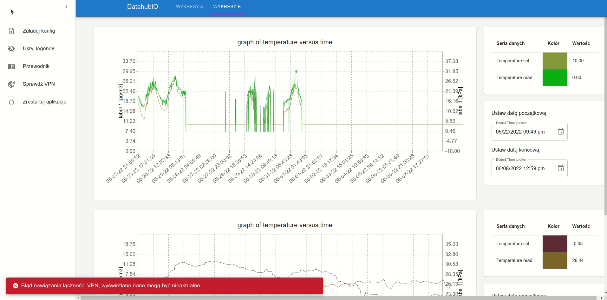

# DatahubIO

Desktop application developed with purpose of visualising data from AGH cloud - DataHub

## Technologies

Project is created with:
* JS
* Redux
* Node.js
* Electron

## Setup

To install application you need to run one of the files in `exec` folder, depending on operating system.
You can also deploy application by running the following commands:

`
npm i
`
`
npm run-script electron:package:linux|windows|mac
`

## Visuals

## Documentation

Documentation in Polish language is available in `docs` folder - [PDF](https://github.com/JanickiJ/DatahubIO/blob/master/docs/DatahubIO.pdf)

## Developers

Bartłomiej Zapart - Backend Developer

Dawid Pastuszka - Backend Developer, Scrum Master

Jakub Janicki - Frontend Developer, DevOps

Maciej Kazalski - Frontend Developer

Michał Stencel - Backend Developer
